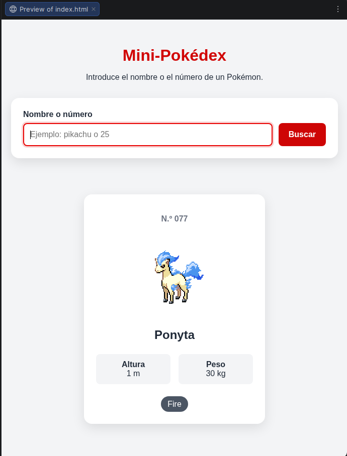
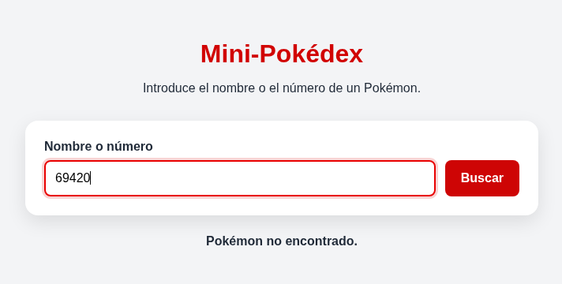
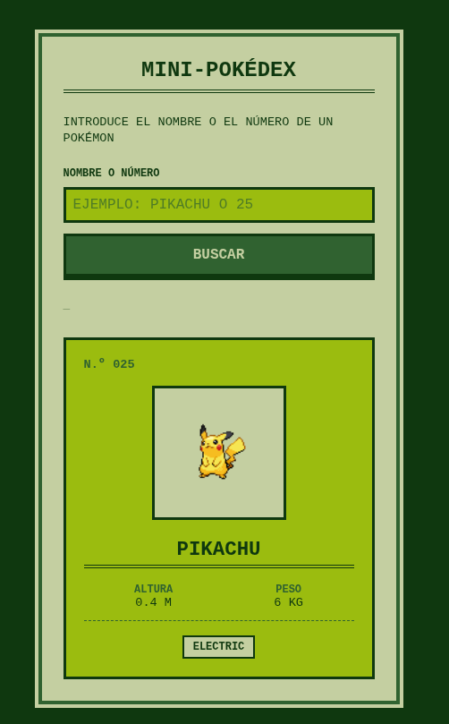
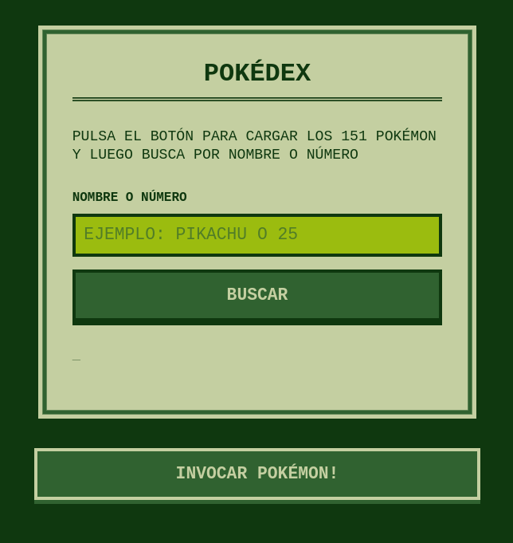
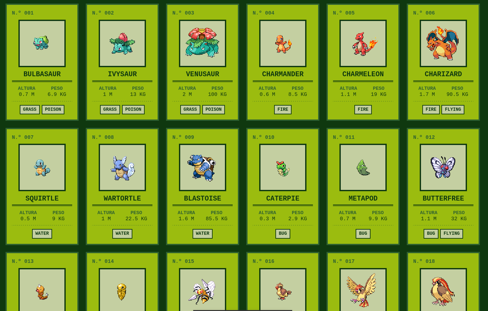
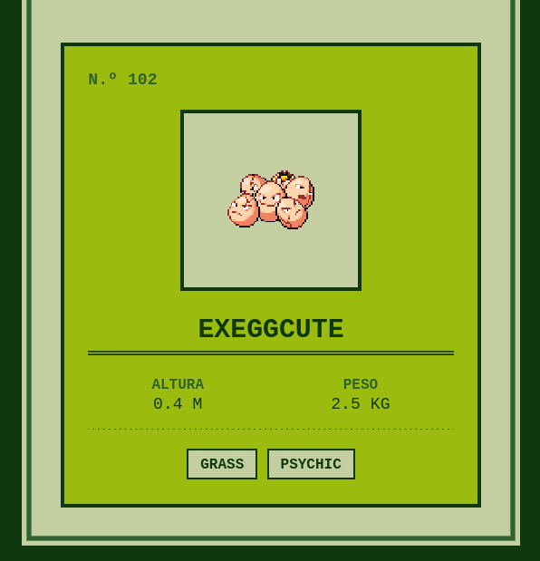
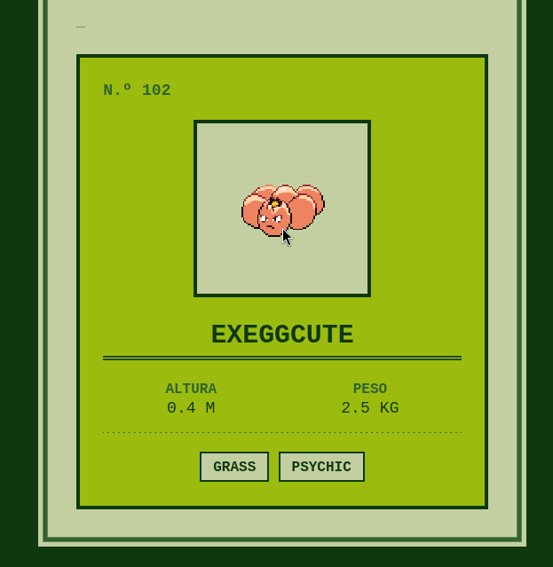
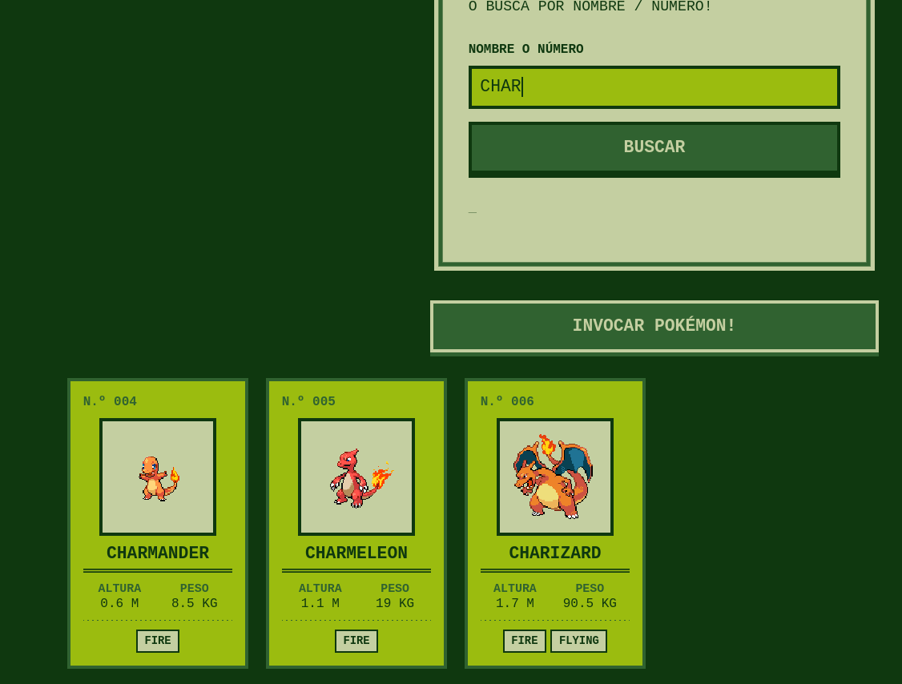

# Pokedex
Una Pokedex, nacida de un proyecto para la asignatura PGL de 1º DAM.

## 1. Punto de partida
Empezamos con el proyecto "Mini-pokedex" como base, un programa en JS que se conecta a una API para traer y tratar información básica del mundo Pokemon. Esta información se representa en navegador con HTML y CSS.

El árbol hasta ahora tiene la siguiente pinta:
```bash
.
├── assets
│   ├── img
│   └── sound
├── css
│   └── style.css
├── index.html
├── js
│   └── app.js
└── README.md

6 directories, 4 files
```

<br>

Aquí hay un ejemplo de su funcionamiento, tras buscar el número 77 este es el resultado. (Shinny porque se pedía una modificación de la mini-Pokedex y la dejé así).

<br>



<br>

Aquí por otro lado tenemos un ejemplo de un error controlado cuando el pokemon que se inserta no existe.



### Funcionalidades
Hasta ahora la mini-Pokedex hace una única llamada a la API y recibe la información de un solo Pokémon, el que se especifique en el buscador ya sea por nombre o por número.

La información que recibe se filtra y se dispone en pantalla con HTML y CSS en la tarjeta que se ve en la imagen.

Cuenta con manejo de errores como mensajes específicos para cuando el pokemon no existe o mensajes de "cargando" mientras se espera la respuesta de la API (también se bloquea el botón de Buscar hasta recibir la respuesta).

### Check-Point!
> Para ir viendo cada commit hecho en el proyecto iré poniendo estos checkpoints, para ir al commit en github haz click en el dibujo.

<a href="https://github.com/slayaglez/Pokedex/commit/4ee8bfbbe5a2972640afbce027bb45806157af1e"></a>

<hr>

## 2. Rediseño y nueva estructura
Antes de traer los 151 Pokémon he preparado la página para que estén cómodos y tengan sitio. De momento solo he tocado el HTML y el CSS, el JS sigue haciendo lo mismo que en el punto de partida.

Lo primero fue cambiarle la cara a la mini-Pokedex, con una estética de Game Boy antigua: cuatro tonos de verde, bordes rectos sin redondear y todo el texto en mayúsculas. Las reglas que sigo están apuntadas en `css/stylerules.md` para no salirme del estilo según vaya añadiendo cosas. (Empezó siendo un .md donde guardaba los hexadecimales que me gustaban pero lo dejé así)



<br>

Después reorganicé la página en tres bloques, uno debajo de otro:

- El panel del buscador, que se queda en el centro como estaba y sigue mostrando dentro la tarjeta del Pokémon buscado.
- Un botón nuevo para cargar los 151 Pokémon.
- La cuadrícula donde aparecerán las tarjetas, directamente sobre el fondo oscuro.



El árbol ahora tiene la siguiente pinta:
```bash
.
├── assets
│   ├── img
│   └── sound
├── css
│   ├── style.css
│   └── stylerules.md
├── index.html
├── js
│   └── app.js
└── README.md

6 directories, 5 files
```

### Cambios en el HTML
El `<main>` ahora tiene la clase `pagina` y envuelve los tres bloques. El panel de antes es ahora un `<div class="contenedor">` y debajo van el botón y la cuadrícula que se rellenará en el próximo paso:

```html
<button id="boton-cargar" class="boton boton--cargar" type="button">Invocar Pokémon!</button>

<section id="cuadricula" class="cuadricula"></section>
```

El botón lleva `type="button"` para que no envíe el formulario del buscador. La sección `#cuadricula` está vacía porque las tarjetas las meterá el JS, igual que ya hace con `#resultado`.

El título ha dejado de ser texto y ahora es una imagen dentro del `<h1>`, con su `alt` para que se siga leyendo como título aunque la imagen no cargue.

### Cambios en el CSS
Para colocar los tres bloques en columna y centrados uso flex en `.pagina`:

```css
.pagina {
  display: flex;
  flex-direction: column;
  align-items: center;
  gap: 1.5rem;
}
```

La cuadrícula se hace con grid. Con esta línea caben tantas columnas como entren en la pantalla, con un mínimo de 130px cada una, así que se debería adaptar solo al móvil y al ordenador:

(Hacerlo responsive debería sumar puntos...)
```css
grid-template-columns: repeat(auto-fill, minmax(130px, 1fr));
```

Probé también con `auto-fit`, pero cuando hay pocas tarjetas las estira hasta ocupar todo el ancho y quedan enormes. Con `auto-fill` mantienen su tamaño.

La tarjeta del Pokémon usa las mismas clases en el buscador y en la cuadrícula. Para que en la cuadrícula salga más pequeña hay unas reglas que solo se aplican ahí dentro, por ejemplo:

```css
.cuadricula .pokemon__imagen {
  width: 110px;
  height: 110px;
  padding: 4px;
}
```

Así el JS genera siempre el mismo HTML y el tamaño depende de dónde se meta la tarjeta. Además reciclamos código para no dañar el medioambiente como nos enseñan en sostenibilidad.

Los dos botones comparten ahora la clase `.boton`, que antes era un selector solo para el botón de buscar. También le añadí un estilo para cuando esté deshabilitado, que hará falta mientras se cargan los datos.

Por último el logo tiene una animación para que parezca que flota. Sube 6px y vuelve a bajar, y con `steps(3)` lo hace a saltitos en vez de suave, que pega más con el estilo retro:

```css
.titulo__imagen {
  animation: flotar 2s infinite steps(3);
}

@keyframes flotar {
  0%, 100% { transform: translateY(0); }
  50% { transform: translateY(-6px); }
}
```
(Perdí casi 3 horas con el CSS en lugar de programar de verdad, espero que la modificación sea facilita)

### Problemas encontrados
Al sacar las tarjetas del panel y ponerlas sobre el fondo oscuro dejaron de verse los bordes, porque eran del mismo verde que el fondo. Lo solucioné cambiando el borde de las tarjetas de la cuadrícula y del botón de cargar a un tono más claro.

Por poner algo.
### Pendiente
El botón de cargar todavía no hace nada y la cuadrícula está vacía. Lo siguiente es el JS que pide los 151 Pokémon a la API y los pinta en `#cuadricula`.

### Checkpoint!

<a href="https://github.com/slayaglez/Pokedex/commit/8468d67db4e4bc262301a77dd32c4011cb04fd2b"></a>

<hr>

## 3. Un JavaScript salvaje ha aparecido
### Preparación
Primero se me ocurre dividir la función de mostrar pokemon en dos responsabilidades diferentes, si hago una que muestre el pokemon (para el pokemon que se busque) y otra para armar el html, podría usar esta última también en la cuadrícula.

Es un cambio mínimo pero creo que será muy cómodo de aquí a dos párrafos.

### Problema
Tras leerme la documentación de la API no hay un método que me devuelva todos los pokemon a la vez (ridículo) así que tocará pedirlos de uno en uno, pensé en hacer un `for` con 151 `awaits` pero habría que estar loco para esperar por las 151, así que le pregunté a un amigo y me dijo que existe un método que involucra `Promise.all` que lanza las 151 peticiones a la vez. Espero no saturar nada ni a nadie con esto.

### Solución
Después de un ratillo he conseguido comprimir la función en esto:
```javascript
const cargarPokemons = async () => {
  const promesas = [];

  for (let i = 1; i <= 151; i++) {
    promesas.push(obtenerPokemon(i));
  }

  pokemons = await Promise.all(promesas);
};
```

Si te fijas, `obtenerPokemon(i)` no devuelve un pokemon sino una promesa, entonces guardo las 151 promesas en un array o en una lista, nidea de como van las listas en JavaScript, imagino que como en Python. 

De esta forma no tenemos que esperar las 151 promesas una por una como un pringado, en su lugar esperamos por todas ellas como por tu ex.

### Checkpoint!
<a href="https://github.com/slayaglez/Pokedex/commit/ee4fadb7f856f23f932db283983aebc6dc2d66ae"></a>

<hr>

### Orquestarlo todo
Creo que ya solo queda conectar todo entre sí y sacar la modi de mañana espero que sea fácil por favor.

Vale pues hice un stream o como se llame en JavaScript (map creo) como se hizo en lo de los tipos pero con toda la tarjeta pokemon en html en su lugar.

```javascript
function mostrarCuadricula(lista) {
    const pokemonHTML = lista
        .map(() => crearTarjeta(pokemon))
        .join("");

    cuadricula.innerHTML = pokemonHTML;
}
```

Esto implica que el stream recibe toda la lista de pokemon y la itera llamando a crearTarjeta por cada uno. Luego las une todas y las mete en el HTML, sabía que separar la función en dos me iba a ser cómodo en un par de párrafos.

En teoría si hice bien el CSS y el HTML (80% de mi tiempo) no debería tener que hacer más que meter la lista de tarjetas HTML en la cuadrícula con `innerHTML`.

Por último he copiado y pegado el event listener que teníamos para buscar pero cambiando un par de cosas a prueba y error, bastante intuitiva esta parte la verdad.

```javascript
botonCargar.addEventListener("click", async (evento) => {

    // Estado de carga
    botonCargar.disabled = true;
    mensaje.textContent = "Separando Pokémon de sus familias...";

    try {
        await cargarPokemons();

        mostrarCuadricula(pokemons);
        mensaje.textContent = "Listo!";

    } catch (error) {
        mensaje.textContent = error.message;
    } finally {
        botonCargar.disabled = false;
    }
});
```

También decido ir guardándome ya el sprite del notas dado la vuelta porque sé que lo voy a necesitar y prefiero meterlo en este commit.

Después de debugguear muchísimo, pero muchísimo (errores como que estaba accediendo al formulario en lugar de al documento en muchos sitios o que no le estaba dando argumentos al map) consigo tener un versión funcionando.



Facilito

### Checkpoint!
<a href="https://github.com/slayaglez/Pokedex/commit/0933e94b6cfda5addf471a73ad2bdd18ff75abce"></a>

<hr>

## 4. Creamos la clase y sus modificaciones

Bueno, se me pide que cree una clase Pokemon.js y creo que a estas alturas justo es el momento de hacerlo.

Listo, creí que sería super difícil pero flipando con lo parecido que es a Java, tras tantas noches pensando en Joatham crear una clase en Java me toma de 1 a 2 minutos.

Me vine arriba y también creé dos métodos para que devuelvan la altura en metros y el peso en kilos porque eso de hectómetros y megagramos me parece de friki que flipas.

```javascript
alturaEnMetros() {
    return this.altura / 10;
}

pesoEnKilos() {
    return this.peso / 10;
}
```

### Sprites

Los sprites deben estar dados la vuelta hasta que pasas el cursor por encima, pero como no me gusta la idea de que todos me den la espalda, lo voy a hacer al revés, se darán la vuelta cuando los vayas a seleccionar, así como tímiditos jajajaja.

Ya hice el CSS pensando en este momento porque estoy en todo así que es solo JS de nuevo, solo tuve que editar el `crearTarjeta()` para que tuviera dos imágenes y se enseñe una y oculte la otra según el cursor.

**Mientras probaba descubrí que Exeggcute tiene un integrante super marginado, adjunto captura:**



pobrecito

bueno

### Checkpoint!
<a href="https://github.com/slayaglez/Pokedex/commit/0123a1e1ef1b45b05b02d8a6a0ea17f6b6738e50"></a>

<hr>

## 5. Puliendo el proyecto

Ahora si que me vine arriba, la verdad es que no entendí bien el enunciado y creí que había que añadir la predicción de búsqueda paralelamente al buscador. En fin fue lo que hice.

Una vez hayas invocado a los pokemon se hará una predicción de qué pokemon buscas, cuando solo pueda ser uno se pondrá en grande.

Me tomó más de 3 funciones y un event listener pero creo que mereció la pena. Este es un ejemplo:



El código básicamente escucha el input del buscador y por cada cambio filtra con un map el array de pokemon que ya teníamos, eso hace que nos ahorremos llamadas a la API pero que la prediccion solo funcione con los 151 pokemon guardados.

### Checkpoint!
<a href="https://github.com/slayaglez/Pokedex/commit/3344d2206b0e0aceb01b88744936b6e3827cfbd4"></a>

<hr>

### Detalles en las tarjetas

Para hacer los detalles en las tarjetas introduje las propiedades nuevas en la clase `Pokemon.js` luego me atreví a tocar el HTML para crear un div flotante donde se verán los detalles, así no tengo que tocar el grid porque me da miedo.

Entonces creé 4 piezas clave en `app.js` 
- nombresEstadisticas: traduce el nombre de la API a algo legible, ej ("special_attack" -> "Ataque esp.")
- botón en la tajeta: `crearTarjeta` también crea un botón q guarda los datos en el propio HTML para luego leerlo con JS (la verdad es que aunque lo hiciera yo la idea me la dio un amigo)
- abrirDetalles(pokemon): Monta el HTML en un panel, lo mete en el div y llama a `detalles.showModal()` pensé que así sería más fácil que extender el div de la tarjeta de la grid, pero ya no estoy seguro.
- Un solo listener para la cuadrícula: A lo mejor parece obvio pero estuve a punto de crear uno por botón.

Verás:
```javascript
cuadricula.addEventListener("click", (evento) => {
  if (evento.target.classList.contains("pokemon__boton")) {
    const id = Number(evento.target.dataset.id);
    const pokemon = pokemons.find((pokemon) => pokemon.id === id);

    abrirDetalles(pokemon);
  }
});
```

Si las tarjetas se crean y borran todo el tiempo no puedo manejar los event listeners tan rápido, lo que si puedo hacer es crear uno en el grid y con `evento.target` comprobar qué se pulsó dentro del grid.

Creí que tuve una idea tremenda pero al parecer es el estándar para casi todo. Por añadir sensaciones personales al ejercicio.

### Checkpoint!
<a href="tengomuchosueño"></a>


## ANEXO
### **Preguntas respondidas durante el seguimiento de la práctica Mini-Pokedex.**

- **¿Por qué escuchamos el evento submit del formulario?**

Para escuchar en todo momento si el formulario se envió o no y actuar en consecuencia

<hr>

- **¿Qué ocurriría si eliminamos evento.preventDefault()?**

Que la página se recargaría, reiniciando el programa que se ejecuta en el cliente (navegador).

<hr>

- **¿Para qué utilizamos trim() y toLowerCase()?**

Normalizamos la cadena para poder trabajar con ella (sin espacios y en minúsculas).

<hr>

- **¿Por qué obtenerPokemon() está declarada con async?**

Porque cualquier llamada a una API debe ser declarada de forma asíncrona para no detener la ejecución del resto del código esperando su respuesta.

<hr>

- **¿Qué devuelve fetch()?**

Devuelve una promesa o ticket con el resultado de hacer la petición a la API.

<hr>

- **¿Para qué se utiliza await?**

Para detener la ejecución de la función donde esté y así dejar paso al resto del código mientras se espera una respuesta.

<hr>

- **¿Por qué debemos comprobar respuesta.ok?**

Porque await puede devolver una respuesta inválida.

<hr>

- **¿Qué hace respuesta.json()?**

Convierte la respuesta a un formato JSON que guardamos en "datos"

<hr>

- **¿Por qué no devolvemos directamente todos los datos recibidos?**

Porque hay datos que no necesitamos y harían la ejecución más pesada.

<hr>

- **¿Qué resultado produce map() al transformar los tipos?**

Una lista de los nombres de los tipos del pokemon (String).

<hr>

- **¿Por qué utilizamos join("") después de map()?**

Porque map() devuelve un array y con join() lo convertimos en una sola cadena de texto.

<hr>

- **¿Qué diferencia existe entre try y catch?**

try intenta una acción o instrucción, si falla se ejecutará el catch

<hr>

- **¿Por qué hemos separado obtenerPokemon() y mostrarPokemon()?**

Porque son dos funciones diferentes que hacen cosas diferentes. Además hasta no recibir una respuesta de la API en obtenerPokemon no deberíamos mostrar nada, se llama división de responsabilidades.

<hr>

- **¿Qué función cumple formatearId()?**

Rellenar con 0 por la izquierda hasta los tres dígitos.

<hr>

- **¿Qué habría que modificar para mostrar varios Pokémon simultáneamente?**

Se me ocurre editar la búsqueda para que con la misma que se trae un pokemon se los traiga a todos y seguir haciendo una sola llamada a la API. Edit: mirando la API te puedes traer todo con `https://pokeapi.co/api/v2/pokemon?limit=100000&offset=0`
